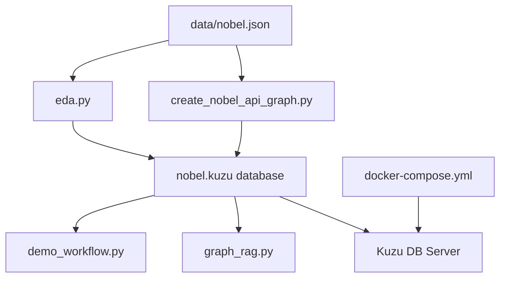

# Graph RAG with Kuzu, DSPy and marimo - プロジェクト概要

## プロジェクト概要

本プロジェクトは、ノーベル賞受賞者データを活用したGraph RAG（Retrieval-Augmented Generation）システムの実装例です。Kuzuグラフデータベース、DSPy（自然言語処理フレームワーク）、marimo（インタラクティブPythonノートブック環境）を組み合わせて、自然言語による質問に対してグラフデータベースから情報を取得し、回答を生成するシステムを構築しています。

## 主要技術スタック

- **Kuzu**: 高性能な組み込み型グラフデータベース
- **DSPy**: LLM（大規模言語モデル）を活用した自然言語処理フレームワーク
- **marimo**: リアクティブPythonノートブック環境
- **Polars**: 高速なデータフレームライブラリ
- **Docker**: データベースのコンテナ化
- **Python 3.13+**: 開発言語

## プロジェクト構成

```
CS-E4780-project2/
├── create_nobel_api_graph.py  # グラフデータベース構築スクリプト
├── demo_workflow.py           # Graph RAGワークフローのデモンストレーション
├── eda.py                     # 探索的データ分析スクリプト
├── graph_rag.py               # Graph RAGアプリケーション
├── data/
│   └── nobel.json             # ノーベル賞受賞者データ
├── docker-compose.yml         # Kuzuデータベースコンテナ設定
├── pyproject.toml             # プロジェクト依存関係定義
└── README.md                  # プロジェクトREADME
```

## ファイル間の依存関係



### 依存関係の詳細

1. **データソース依存**
   - `eda.py`と`create_nobel_api_graph.py`は両方とも`data/nobel.json`を読み込む
   - 両スクリプトは独立して実行可能

2. **データベース依存**
   - `eda.py`と`create_nobel_api_graph.py`は`nobel.kuzu`データベースを作成・更新
   - `demo_workflow.py`と`graph_rag.py`は作成されたデータベースを読み込み専用で使用

3. **実行順序**
   1. 最初に`eda.py`または`create_nobel_api_graph.py`でデータベースを構築
   2. その後`demo_workflow.py`でGraph RAGパイプラインを実験
   3. 最後に`graph_rag.py`で完成されたアプリケーションを実行

## 主要機能

1. **データETL（Extract, Transform, Load）**
   - JSONフォーマットのノーベル賞データを読み込み
   - 不正なデータの修正（日付フォーマットなど）
   - グラフ構造への変換

2. **グラフデータベース構築**
   - ノード：Scholar（学者）、Prize（賞）、City（都市）、Country（国）、Continent（大陸）、Institution（機関）
   - リレーション：WON（受賞）、BORN_IN（出生地）、AFFILIATED_WITH（所属）など

3. **Graph RAGパイプライン**
   - スキーマ取得とプルーニング
   - Text2Cypher（自然言語→Cypherクエリ変換）
   - クエリ実行と結果取得
   - 自然言語での回答生成

4. **インタラクティブUI**
   - marimoノートブックによる対話的な分析
   - スライダーやカレンダーによるデータフィルタリング
   - リアルタイムでのクエリ実行と結果表示

## 使用方法

1. 環境セットアップ
```bash
uv sync
source .venv/bin/activate
```

2. Kuzuデータベースサーバー起動
```bash
docker compose up
```

3. データベース構築
```bash
uv run create_nobel_api_graph.py
```

4. Graph RAGアプリ実行
```bash
uv run marimo run graph_rag.py
```

## 環境変数

- `OPENROUTER_API_KEY`: OpenRouter APIキー（LLMアクセス用）
- `.env`ファイルに設定

## 拡張可能性

- ベクトル検索との組み合わせ
- より高度なクエリ最適化
- インタラクティブなグラフ可視化
- 他のデータソースとの統合